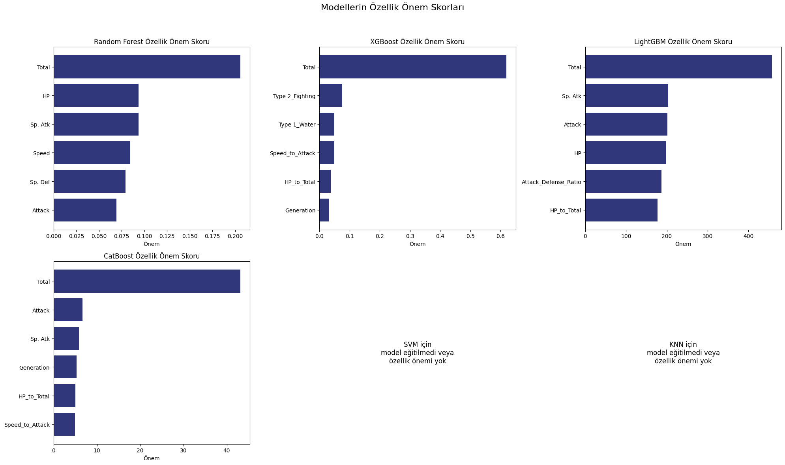

# Pokémon Legendary Sınıflandırma – Bitirme Projesi

Bu repo, Yapay Zeka Akademisi kapsamında hazırladığım Pokémon veri seti üzerinde “Legendary” (efsanevi) sınıfı tahminine yönelik makine öğrenimi projeme ait Jupyter Notebook çalışmasını içermektedir. Amaç, Pokémonların temel istatistiklerine ve tür bilgilerine dayanarak efsanevi olup olmadıklarını çeşitli algoritmalarla tahmin etmek ve en dengeli performansı veren modeli belirlemektir.

---

## İçerik

| Klasör / Dosya                     | Açıklama                          |
|-----------------------------------|----------------------------------|
| elif_karadeniz_pokemon_project.ipynb | Projenin ana Jupyter Notebook'u   |
| requirements.txt                  | Projede kullanılan Python kütüphaneleri |

---

## Kullanılan Yöntem ve Teknolojiler

- **Python**  
- **Pandas, NumPy, Matplotlib, Seaborn** – Veri işleme ve görselleştirme  
- **Scikit-learn** – Modelleme ve performans ölçümleri  
- **CatBoost, XGBoost, LightGBM** – Gelişmiş gradient boosting algoritmaları  
- **Random Forest, SVM, KNN** – Klasik makine öğrenimi algoritmaları  
- **Jupyter Notebook** – Proje adımlarının yürütülmesi  

---

## Proje Adımları

1. **Veri Seti ve Problem Tanımı**  
   Pokémon veri seti tanıtıldı, Legendary sınıfı hedef değişken olarak belirlendi.  

2. **Keşifsel Veri Analizi (EDA)**  
   Eksik veriler incelendi, istatistiksel özetler çıkarıldı, aykırı değerler belirlendi.  

3. **Özellik Mühendisliği**  
   - Eksik “Type 2” değerleri “No Type” olarak dolduruldu.  
   - Yeni özellikler oluşturuldu:  
     - Tek tip Pokémonların tespiti için `Is_Mono_Type`  
     - `Attack_Defense_Ratio` (Saldırı / Savunma oranı)  
     - `HP_to_Total` (HP’nin toplam değere oranı)  
     - `Speed_to_Attack` (Hız / Saldırı oranı)  
   - Nesil (Generation) bilgisi için one-hot encoding uygulandı.  

4. **Aykırı Değer Analizi ve Dönüşümler**  
   Ayırıcı özelliklerde tespit edilen aykırı değerler analiz edildi.  
   Log ve Box-Cox dönüşümleri ile dağılımlar normalize edildi.  

5. **Model Eğitimi ve Değerlendirme**  
   - 6 farklı algoritma ile model eğitimi gerçekleştirildi: Random Forest, SVM, KNN, XGBoost, LightGBM, CatBoost.  
   - Performans metrikleri (Accuracy, Precision, Recall, F1-Score) karşılaştırıldı.  
   - Confusion matrix analiz edildi.  

6. **Dengesiz Veri Seti İçin SMOTE Uygulaması**  
   Azınlık sınıfı (Legendary) için veri çoğaltılarak sınıf dengesi sağlandı ve modeller yeniden test edildi.  

7. **Sonuçların Karşılaştırılması ve En İyi Modelin Belirlenmesi**  
   Performans bakımından CatBoost modeli en dengeli sonuçları verdi.  

---

## Öne Çıkan Sonuçlar

| Model      | Accuracy | Precision (Legendary) | Recall (Legendary) | F1-Score (Legendary) | Yorum                              |
|------------|----------|----------------------|--------------------|---------------------|-----------------------------------|
| CatBoost   | 0.96     | 0.64                 | 0.90               | 0.75                | Hem yüksek recall hem dengeli performans |
| XGBoost    | 0.95     | 0.60                 | 0.90               | 0.72                | Yüksek recall, düşük precision     |
| LightGBM   | 0.95     | 0.56                 | 0.90               | 0.69                | XGBoost’a benzer performans        |
| SVM        | 0.93     | 0.83                 | 0.50               | 0.62                | Yüksek precision, düşük recall     |
| RandomForest | 0.95   | 0.60                 | 0.60               | 0.60                | Ortalama performans                 |
| KNN        | 0.93     | 0.75                 | 0.30               | 0.43                | En düşük recall, Legendary kaçırıyor|

---

## Bulgular ve Değerlendirme

- **Toplam İstatistikler (`Total`)** tüm modellerde en önemli özellik olarak öne çıktı.  
- Özellik mühendisliği ile eklenen oranlar (Attack_Defense_Ratio, HP_to_Total, Speed_to_Attack) model performansını artırdı.  
- Gradient Boosting tabanlı modeller (CatBoost, XGBoost, LightGBM) Legendary sınıfını yakalamada yüksek recall sağladı.  
- SVM yüksek precision ile yanlış pozitifleri azalttı ancak birçok gerçek Legendary Pokémonu kaçırdı (düşük recall).  
- SMOTE ile azınlık sınıf dengelendiğinde Random Forest ve KNN modellerinin recall değerleri yükseldi.  
- En dengeli ve güvenilir model olarak **CatBoost** seçildi.  

---
## Özellik Önemi



- **Total** (Toplam istatistik) tüm modellerde (Random Forest, XGBoost, LightGBM, CatBoost) en kritik özellik olarak öne çıkmıştır.  
- Random Forest, HP, Sp_Atk, Speed gibi temel istatistiklere dengeli önem verirken;  
- XGBoost tür bilgisi ve Speed_to_Attack oranına ağırlık vermiştir.  
- LightGBM saldırı odaklı istatistiklere ve Attack_Defense_Ratio’ya önem verir.  
- CatBoost ise Attack, Sp_Atk ve Generation özelliklerine odaklanır.  
- SVM ve KNN modelleri doğrudan özellik önem skoru vermediği için bu modellerde özellik önemi bulunmamaktadır.

---

## Kullanım

1. Gerekli kütüphaneleri yükleyin:  
```bash
pip install -r requirements.txt
